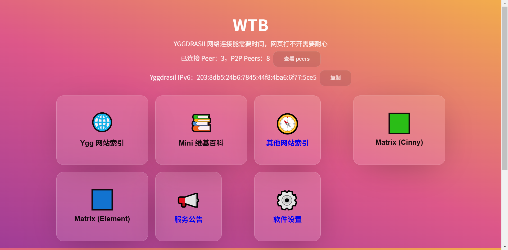
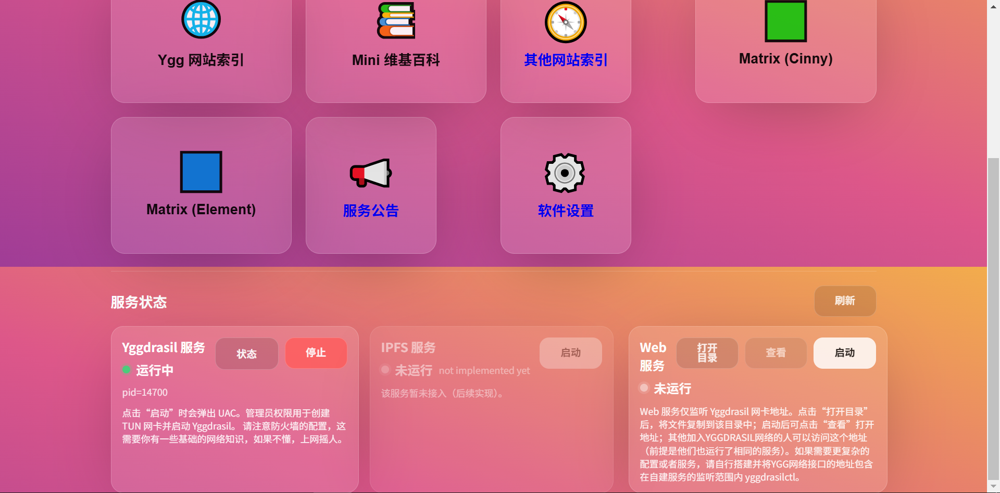
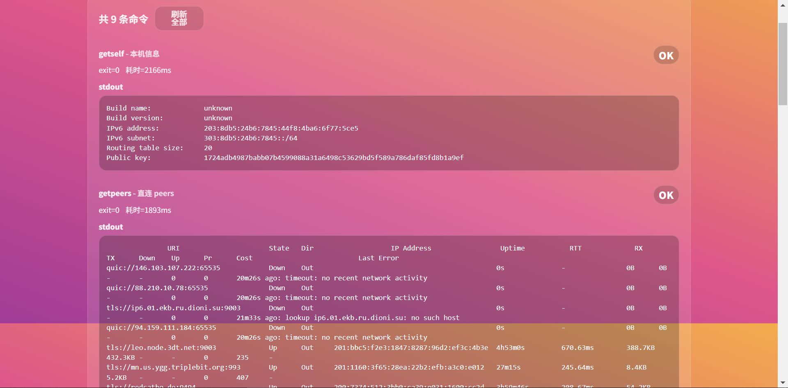
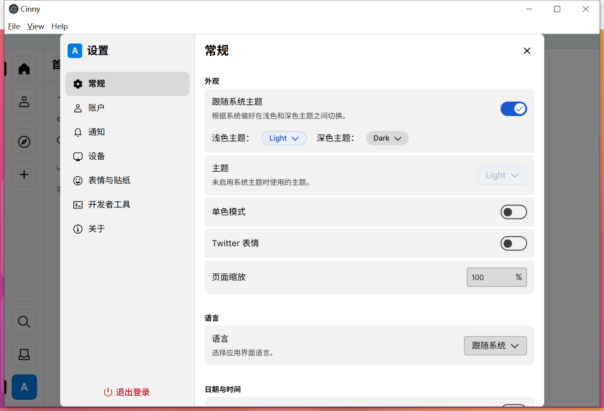

wtb — 实验性客户端

概览
----
这是一个实验性质的客户端（wtb），用于在 Yggdrasil 点对点网络环境中进行概念验证与调试。项目包含：

- 与 Yggdrasil 网络联通的客户端逻辑
- 嵌入式的 Matrix 客户端（例如 Cinny），以及使用系统浏览器访问 Element 的支持
- 简易的文件 web 服务与内置工具，用于在 P2P 网络中分享与访问内容

注意：本项目用于实验和学习目的，可能包含临时实现或简化的安全措施。

主要特性
----
- 自动连接公共 Yggdrasil 节点和尝试通过 DHT 发现对等节点
- 嵌入式浏览器/客户端（Cinny）用于快速测试 Matrix 聊天场景
- 内置静态文件服务，可将指定目录通过 Yggdrasil 网络共享

先决条件
----
- Node.js (建议 16+)
- npm 或 yarn
- 已安装并配置好的 Yggdrasil 节点（参见 Yggdrasil 官方文档）

快速开始（开发环境）
----
在 Windows（或类 Unix）机器上，先确保 Yggdrasil 已启动并能正常运行，然后：

```bash
# 安装依赖
npm install

# 启动开发模式（带热重载）
npm start
```

启动说明
----
1. 先启动 Yggdrasil 服务并等待其建立连接。
2. 启动本项目（见上）后，应用会尝试连接若干公共 Yggdrasil 节点并建立 peer 关系。
3. 网络环境影响连接成功率；在无公网环境下，可通过局域网热点或网线直连进行邻居发现和测试。

开发与构建
----
- 运行测试：

```bash
npm test
```

- 生产构建（示例）：

```bash
npm run build
```

请检查 `package.json` 中的 script 部分以获取完整命令和可用选项。

目录说明
----
- `src/` — 主进程与后端逻辑
- `renderer/` — 前端 React/渲染进程代码
- `assets/` — 静态资源与嵌入内容（包含 Cinny / Element 资源）
- `release/` — 打包产物与安装器相关文件
- `wtb-data/`, `yggdrasil/` — 运行时配置与数据

# 截图







